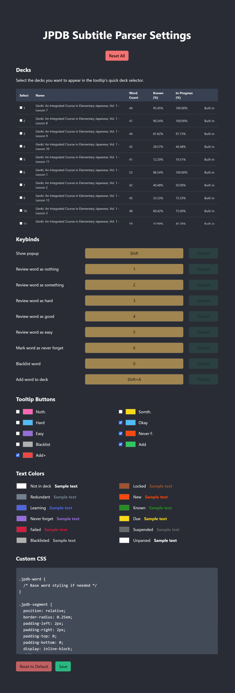

# DEPRECATED

This repo was always just for seeing what was possible for me to do. I've now ported it to build on top of a much more stable extension with greater functionality.
See [anki-jpdb.reader-extension](https://github.com/Dillpickleschmidt/anki-jpdb.reader-extension) for the new version.

\*the new version is built on top of Kagu-chan's [anki-jpdb.breader](https://github.com/Kagu-chan/anki-jpdb.reader) (which is also inspired from Max Kamps' [jpd-breader](https://github.com/max-kamps/jpd-breader))

## JPDB + ASB-Player Subtitle Parser

Chrome extension for ASB-Player sentence mining with JPDB.

## Why not jpd-breader?

I had issues getting jpd-breader to work consistently with ASB-Player. Also I didn't find its UI very appealing.

Also ASB-Player's subtitles look ugly and it doesn't offer the customization I was looking for. Since I'm re-styling the spans for colorization anyway, this adds much nicer outlines as well.

I also added various quality of life improvements in addition to better UI. See the [Features](#features) section for more details.

## Stack

- [SolidJS](https://www.solidjs.com/)
- [TypeScript](https://www.typescriptlang.org/)
- [Chrome Extension Manifest Version 3](https://developer.chrome.com/docs/extensions/mv3/intro/)

   
   

## Installation

1. Download and unzip the latest release
2. Load Extension on Chrome
   1. Open - Chrome browser
   2. Access - chrome://extensions
   3. Check - Developer mode
   4. Find - Load unpacked extension
   5. Select - Choose the folder you unzipped

## Dev Installation

1. Clone new repository.
2. Run `npm i`
3. Run `npm run dev`
4. Load Extension on Chrome
   1. Open - Chrome browser
   2. Access - chrome://extensions
   3. Check - Developer mode
   4. Find - Load unpacked extension
   5. Select - `dist` folder in this project (after dev or build)
5. If you want to build in production, Just run `npm run build`.

## How To Use

1. Pin and click on this extension's icon and add your jpdb api key (found in the bottom of jpdb.io's settings page)
2. Open a video and add the subtitle via ASB-Player and it should auto parse everything (you should notice the subtitles' styles change)
3. Click the extension's icon next to your url bar again and click the Settings button. At the top of the page you'll see a list of your decks. Check the ones you want to appear in the tooltip dropdown.
4. Go back to the video and you should see the decks you checked appear in your dropdown. Clicking any "add" button will add the word to the dropdown's currently selected deck.

> If you want to use hotkeys to speed up review/adding, check out the Settings page again.

## Features

- Add words to jpdb deck with sentences + translations
- Customizable subtitle colorization based on word's state using nice, user friendly html color pickers
- Choose which buttons you want to appear in the tooltip
- Review words directly while watching (enable buttons for it in the extension's Settings page)
- Customizable button colorization
- Choose which deck you want to add to on the fly
- Fullscreen support
- Auto translate sentence when adding word to deck or manually specify with "Add+" button
- Completely custom CSS if you want to modify the subtitle appearance (+ same class selectors as jpd-breader)

### Features Missing

- touchscreen support
- forq

### Notes

This only works with ASB-Player and does not parse anything else. Maybe someday I'll add support for other stuff :D
